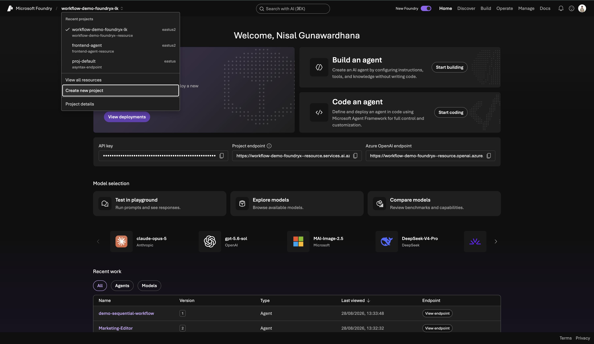
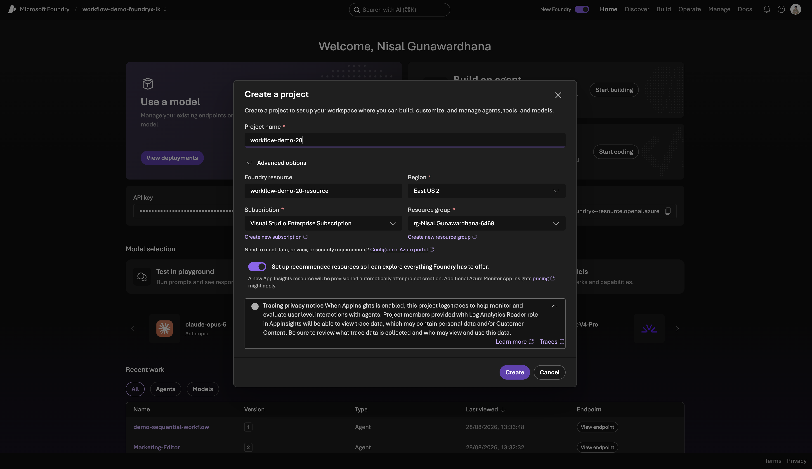
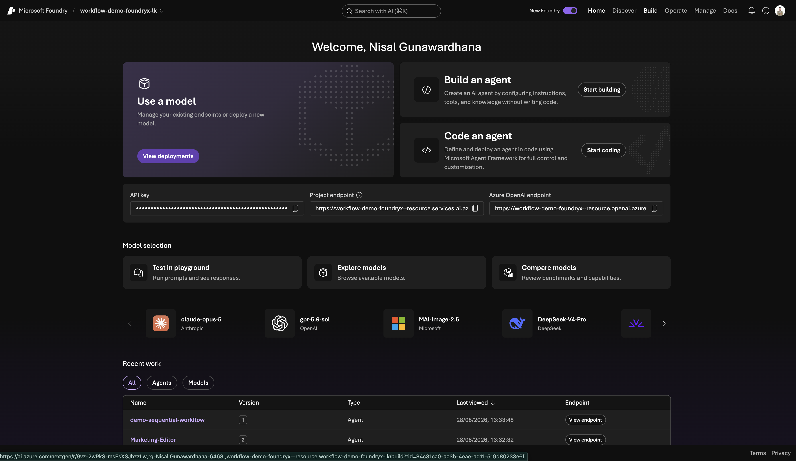
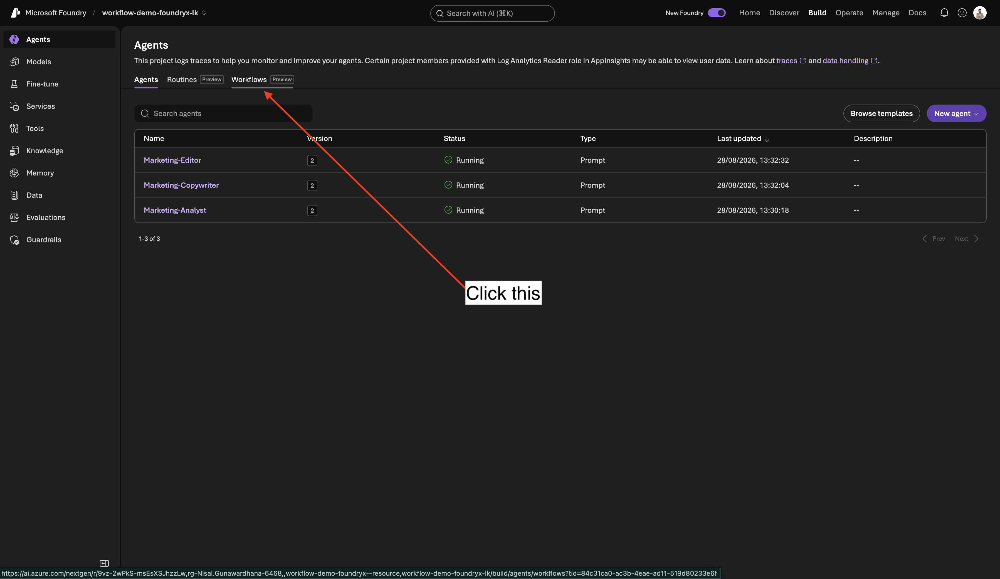
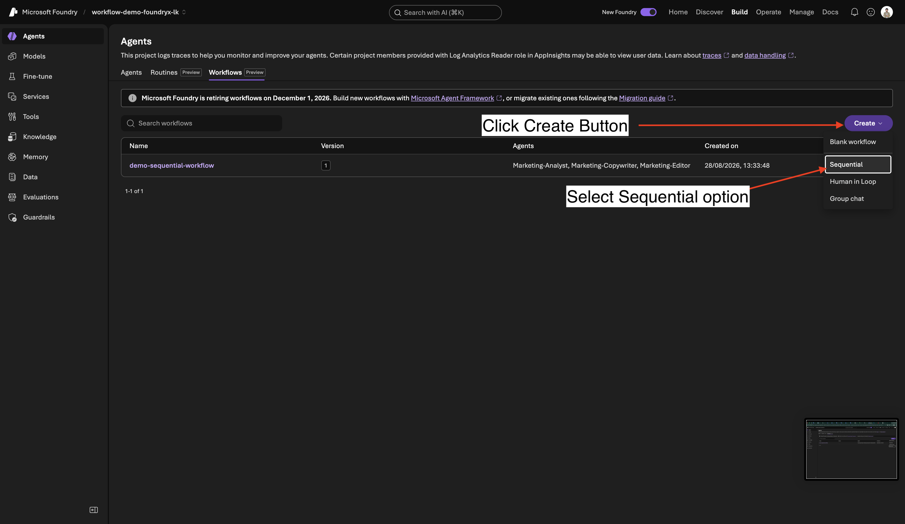

# Demo: Sequential Workflow Sample

A **sequential** workflow that turns a raw product description into polished marketing copy by chaining three agents:

```
Start → Marketing-Analyst → Marketing-Copywriter → Marketing-Editor → End
```

| Step | Agent | Does |
| --- | --- | --- |
| 1 | **Marketing-Analyst** | Pulls key features, target audience, and unique selling points out of the product description. |
| 2 | **Marketing-Copywriter** | Turns that analysis into a ~150-word marketing copy block. |
| 3 | **Marketing-Editor** | Fixes grammar, tightens clarity, enforces a consistent tone, and returns the final polished copy. |

Each agent's output is automatically passed as the input message to the next agent (`System.LastMessage`).

---

## Build it in Microsoft Foundry

### 1. Sign in and create a project

1. Go to [ai.azure.com](https://ai.azure.com) and sign in to Microsoft Foundry.
2. Open the project switcher (top-left, next to **Microsoft Foundry**) and choose **Create new project**.

   

3. Give the project a **name** (e.g. `workflow-demo`). Under **Advanced options** you can pick the Foundry resource, region, subscription, and resource group — the defaults are fine for a demo. Leave **Set up recommended resources** on, then click **Create**.

   

### 2. Open the Workflows tab

1. In the top nav, go to **Build**.
2. In the left rail, select **Agents**, then switch to the **Workflows** tab (next to *Agents* and *Routines*).

   

### 3. Create a Sequential workflow

Click **Create** (top-right) and choose **Sequential**.



### 4. Add and connect the three agents

The Sequential builder starts with a **Start** node. Add three agent nodes after it, in order. For each node, open the **Agent** panel on the right, click **Select an agent → Create a new agent**, and paste the instructions below.



Keep the default node settings:

- **Conversation context**: `System.ConversationId`
- **Input message**: `System.LastMessage`
- **Automatically include agent response as part of the workflow conversation**: on

#### Agent 1 — `Marketing-Analyst`

```
You are a marketing analyst. Given a product description, identify:
Key features
Target audience
Unique selling points
```

#### Agent 2 — `Marketing-Copywriter`

```
You are a marketing copywriter. Given a block of text describing features, audience, and USPs, compose a compelling marketing copy (like a newsletter section) that highlights these points. Output should be short (around 150 words), output just the copy as a single text block.
```

#### Agent 3 — `Marketing-Editor`

```
You are an editor. Given the draft copy, correct grammar, improve clarity, ensure consistent tone, give format and make it polished. Output the final improved copy as a single text block.
```

### 5. Save, preview, and test

1. Click **Save** (name it e.g. `demo-sequential-workflow`).
2. Click **Preview** to open the test chat.
3. Paste a product description and run it. Example input:

   ```
   Meet AuroraDesk — a height-adjustable standing desk with a whisper-quiet dual motor,
   one-touch memory presets, built-in wireless charging, and a bamboo top. Aimed at
   remote workers and small studios who care about ergonomics and a tidy setup.
   ```

   You should get a short, polished marketing paragraph back — the combined result of all three agents.

4. When it looks good, click **Publish** to make the workflow callable from code.

---

## Files

| File | Purpose |
| --- | --- |
| [`run_agent.js`](run_agent.js) | Invokes the published workflow with the Azure AI Projects SDK and prints the response. |
| [`package.json`](package.json) | Node dependencies (`@azure/ai-projects`, `@azure/identity`). |
| [`.env`](.env) | Project endpoint and workflow id used by the script. |

---

## Run it from code

```bash
npm install
az login
node run_agent.js
```

`run_agent.js` retrieves the workflow by name, creates a conversation, sends a message, and prints `response.output_text`. Update `endpoint` and `agentName` at the top of the file (or the values in [`.env`](.env)) to match your project and the name you saved the workflow as.
