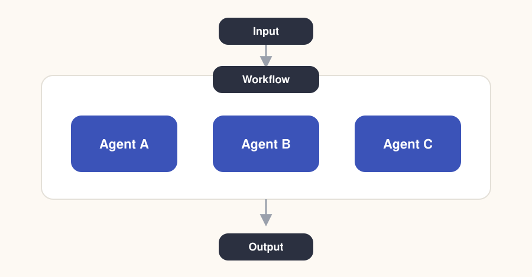
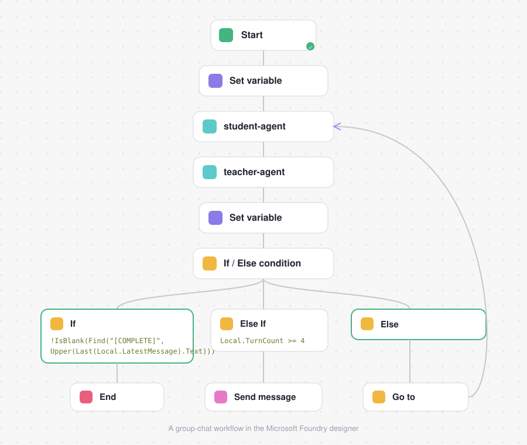

# 2. What are workflows?

> Part of the [Microsoft Foundry Workflows docs](README.md).
> **Previous:** [Introduction](01-introduction.md) · **Next:** [Identify workflow patterns](03-identify-workflow-patterns.md)

---

Workflows in Microsoft Foundry provide a way to orchestrate AI-driven actions using a **visual, declarative approach**. Rather than writing code, you define a sequence of steps that describe *what* should happen and *when*, allowing the platform to manage execution and state. This makes workflows well-suited for business processes that combine AI reasoning, logic, and user interaction.

A workflow consists of **connected nodes**, where each node performs a specific function:

- some nodes **invoke agents**,
- others **evaluate conditions**, **manage data**, or **communicate with users**.

Together, these nodes form an **execution path** that determines how requests move through the system. By arranging and configuring nodes, you control how information flows and how decisions are made.

  

  

## Why workflows matter

| Capability | What it means in practice |
| --- | --- |
| **Coordinate multiple agents** | Single-agent solutions struggle with complex or ambiguous tasks. Workflows combine agents with different responsibilities — classification, decision-making, resolution — into one cohesive process. |
| **Balance automation with oversight** | When confidence is low or more context is required, a workflow can pause execution, request human input, or escalate a decision. |
| **Manage state** | Variables carry outputs from one step to the next, so later nodes can act on earlier results. |
| **Stay observable** | The visual designer makes it easy to trace execution paths and see where logic branches or decisions occur. |

By understanding what workflows are and the problems they're designed to solve, you establish the conceptual foundation needed to build, extend, and reason about agent-driven systems in Foundry.

---

**Previous:** [Introduction](01-introduction.md) · **Next:** [Identify workflow patterns](03-identify-workflow-patterns.md)
