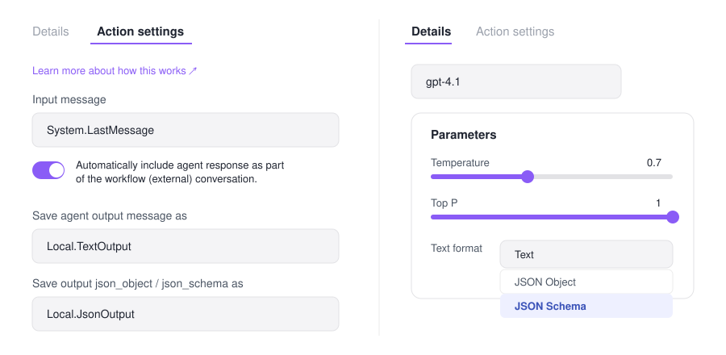
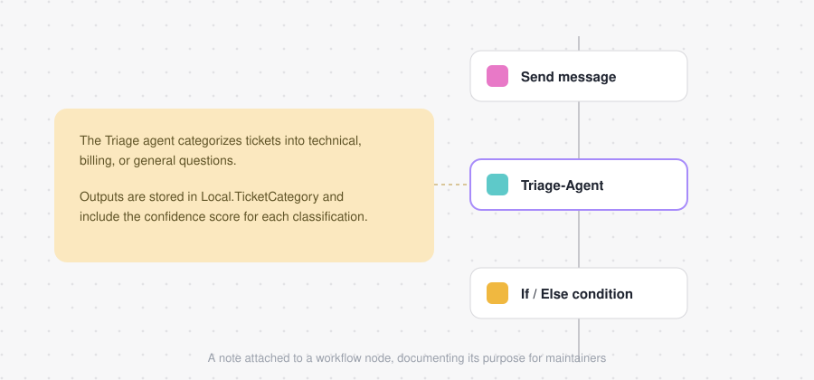

# Introduction to Agent-Driven Workflows in Microsoft Foundry

This module is the conceptual foundation for building, extending, and reasoning about agent-driven systems in Microsoft Foundry. It walks through what workflows are, the problems they solve, the patterns you can model with them, and how to build, maintain, and consume them from code.

> **New here?** Start with the [main README](../README.md) for a one-page overview of Microsoft Foundry, then come back to this guide for the detail.

## Contents

1. [Introduction](#1-introduction)
2. [What are workflows?](#2-what-are-workflows)
3. [Identify workflow patterns](#3-identify-workflow-patterns)
4. [Create workflows in Microsoft Foundry](#4-create-workflows-in-microsoft-foundry)
5. [Add agents to a workflow](#5-add-agents-to-a-workflow)
6. [Apply Power Fx in workflows](#6-apply-power-fx-in-workflows)
7. [Maintain workflows in Microsoft Foundry](#7-maintain-workflows-in-microsoft-foundry)
8. [Use workflows in code](#8-use-workflows-in-code)
9. [Key terms](#9-key-terms)

---

## 1. Introduction

Modern AI solutions often rely on **multiple agents working together** to analyze inputs, make decisions, and take action. In Microsoft Foundry, agent workflows provide a way to orchestrate these interactions using a combination of **agents**, **control flow**, and **runtime safeguards**.

Foundry includes a **visual workflow builder** that lets you design and test these systems without writing extensive code. Using the canvas, you can define:

- how agents are invoked,
- how data moves between steps,
- how decisions are made based on agent outputs.

You can also observe execution paths and inspect intermediate results to understand how your workflow behaves at runtime.

### The scenario used throughout this module

You're a developer responsible for automating **customer support workflows** at a growing SaaS company. Your team receives a steady stream of support tickets ranging from billing disputes to API errors and simple how-to questions.

- Manually reviewing each request **doesn't scale**.
- Fully automating responses **isn't always safe**.

Workflows let you combine multiple AI agents, conditional logic, and human-in-the-loop escalation. By using agent-driven workflows, you can triage many support requests efficiently and at scale **while maintaining reliability and control**.

### What you'll be able to do

- Explain how workflow nodes, variables, and agent outputs work together to control execution paths.
- Use structured agent outputs and conditional logic to route requests to the appropriate workflow steps.
- Implement loops (For-Each) to process multiple inputs efficiently within a single workflow.
- Apply human-in-the-loop and escalation patterns to manage uncertainty and low-confidence agent responses.
- Use Power Fx expressions to manipulate data, evaluate conditions, and control flow within workflows.

---

## 2. What are workflows?

Workflows in Microsoft Foundry provide a way to orchestrate AI-driven actions using a **visual, declarative approach**. Rather than writing code, you define a sequence of steps that describe *what* should happen and *when*, allowing the platform to manage execution and state. This makes workflows well-suited for business processes that combine AI reasoning, logic, and user interaction.

A workflow consists of **connected nodes**, where each node performs a specific function:

- some nodes **invoke agents**,
- others **evaluate conditions**, **manage data**, or **communicate with users**.

Together, these nodes form an **execution path** that determines how requests move through the system. By arranging and configuring nodes, you control how information flows and how decisions are made.

<p align="center">
  
</p>

<p align="center">
  
</p>

### Why workflows matter

| Capability | What it means in practice |
| --- | --- |
| **Coordinate multiple agents** | Single-agent solutions struggle with complex or ambiguous tasks. Workflows combine agents with different responsibilities — classification, decision-making, resolution — into one cohesive process. |
| **Balance automation with oversight** | When confidence is low or more context is required, a workflow can pause execution, request human input, or escalate a decision. |
| **Manage state** | Variables carry outputs from one step to the next, so later nodes can act on earlier results. |
| **Stay observable** | The visual designer makes it easy to trace execution paths and see where logic branches or decisions occur. |

By understanding what workflows are and the problems they're designed to solve, you establish the conceptual foundation needed to build, extend, and reason about agent-driven systems in Foundry.

---

## 3. Identify workflow patterns

When building agent-driven solutions, the **structure** of your workflow matters as much as the agents themselves. Different problems require different orchestration approaches, depending on how decisions are made, how data flows, and whether human input is required. Foundry provides several predefined workflow patterns.

| Pattern | How it works | Best for | Trade-off |
| --- | --- | --- | --- |
| **Sequential** | A fixed, step-by-step path. Each node executes in order and passes its output to the next step. | Pipelines and multi-stage processes — validate input, enrich data, generate a final response. A good starting point while learning. | Predictable and easy to reason about, but not adaptive. |
| **Human-in-the-loop** | Introduces pauses where user input or approval is required before the workflow continues. The workflow asks a question, waits for a response, then resumes based on that input. | Approvals, confirmations, or situations where missing context must be supplied by a person. | Adds oversight at the cost of latency / a required human. |
| **Group chat** | Dynamic orchestration across multiple agents. Control shifts between agents based on context, rules, or intermediate results rather than following a fixed path. | Scenarios where specialized agents collaborate on complex requests — customer support, multi-domain question answering. | Flexible and powerful, but harder to predict and debug. |

Each pattern provides a foundation for structuring agent interactions, managing control flow, and incorporating human input as needed. Recognize these patterns and choose an orchestration approach that fits your scenario **before** you begin designing.

---

## 4. Create workflows in Microsoft Foundry

Microsoft Foundry provides a **visual designer** that lets you build workflows as a sequence of connected nodes. Each node represents a specific action — invoking an agent, evaluating logic, or transforming data — and the connections between nodes define how execution flows from one step to the next.

You can start a workflow from a **blank canvas** or from a **predefined pattern** (such as a sequential workflow). The designer displays the workflow as a series of nodes laid out in execution order. As you build, you can move nodes, insert new steps, and inspect configuration details directly on the canvas.

> ⚠️ **Workflows aren't saved automatically.** Save your changes regularly to preserve each version of your design.

<p align="center">
  
</p>

### Main node types

| Category | Node | What it does |
| --- | --- | --- |
| **Invoke** | **Invoke agent** | Invokes an AI agent from your project (or creates a new one). Returns free-text responses or structured output (e.g. JSON) that other nodes can use. Used for classification, reasoning, recommendations, or any AI-driven task. |
| **Flow** | **If/Else** | Branches execution based on conditions. |
| **Flow** | **Go To** | Jumps to another node in the workflow. |
| **Flow** | **For Each** | Loops over a list of items, performing the same actions for each one. |
| **Data transformation** | **Set Variable** | Assigns a value to a variable for later use. |
| **Data transformation** | **Reset Variable** | Clears or reinitializes a variable. |
| **Data transformation** | **Parse value** | Extracts specific data from structured outputs or converts values to different formats. |
| **Basic chat** | **Send message / Ask a question** | Sends messages to the user or collects input. Often paired with variables to capture responses that influence later logic or agent decisions. |
| **End** | **End** | Marks the conclusion of a workflow. Can optionally return a final result or status. |

### Nodes, control flow, and variables

- **Control flow** determines how each step is executed.
- **Variables** provide shared state across nodes, letting outputs from one step — agent results or user input — inform decisions or trigger more actions.
- Agent nodes are important, but effective automation relies on the **coordinated use of all node types**.

### Testing

Workflows execute within a **conversational context**, so you can interact with them through the chat window. This lets you observe how inputs move through the nodes and validate that each step behaves as expected before adding more complexity. As workflows grow, the visual designer makes it easy to trace execution paths and identify where logic branches or decisions occur.

Understanding nodes and how to combine them gives you the foundation for creating workflows that integrate AI reasoning, data handling, and control logic. **Nodes are the building blocks you assemble** to turn automation goals into functional, scalable workflows.

---

## 5. Add agents to a workflow

Agents are the **core reasoning components** within a Foundry workflow. Adding agents enables AI-driven decision-making, classification, and response generation as part of a larger orchestration. Each agent can be configured with a specific purpose, model, prompt, and set of tools.

### Adding an agent

You add agents by inserting an **Invoke agent** node. This node can:

- reference an **existing agent** from your Foundry project, or
- **create a new agent** directly within the workflow designer.

The Invoke agent editor lets you configure **tools, knowledge bases, memory, and guardrails** for the agent, tailoring its behavior to the workflow's needs. When you invoke an agent, the workflow passes context — user input or previously set variables — to the agent and receives a response that can be used in later steps.

### Reuse and modular design

Agents can be **reused across multiple workflows**, which encourages modular design. For example:

- a single **categorization agent** might be invoked in many workflows to classify incoming requests,
- while different **resolution agents** handle follow-up actions.

This separation of concerns makes workflows easier to maintain and evolve over time.

### Structured output

In addition to natural-language responses, agents can be configured to return **structured output**. By defining a response format such as a **JSON schema**, you ensure agent output follows a predictable shape. Structured outputs are especially useful when agent responses drive control flow — routing logic or variable assignment in later nodes.

- Define an agent's output schema in the **parameters of the Details tab** of the Invoke agent editor (set *Text format* to **JSON Object** or **JSON Schema**).
- Store agent output in a **variable** via the **Action settings** of the Invoke agent node (e.g. *Save agent output message as* `Local.TextOutput`, *Save output json_object/json_schema as* `Local.JsonOutput`).

<p align="center">
  
</p>

Once an agent is added, its output can be stored in a variable and referenced throughout the workflow — influencing decisions, triggering conditional branches, or providing input to other agents. By thoughtfully adding and configuring agents, you transform a simple sequence of actions into an **intelligent, adaptive workflow**.

---

## 6. Apply Power Fx in workflows

**Power Fx** is the low-code, Excel-like language that acts as the **glue** of a workflow. It lets you manipulate data, evaluate conditions, and control execution flow without writing complex code. Power Fx formulas are used wherever decisions are made, variables are set, or loops are applied — so workflows can react dynamically to user input, agent outputs, or stored data.

### How formulas work

A Power Fx formula is an **expression that evaluates to a value**. Formulas can reference:

| Variable kind | Description | Examples |
| --- | --- | --- |
| **System variables** | Contextual information about the workflow or conversation. | `System.LastMessage`, `System.Activity`, current user info |
| **Local variables** | Data captured or created during workflow execution, usable in subsequent nodes. | `Local.Input`, `Local.Confidence`, `Local.ItemList` |

Examples:

- Convert a user's input to uppercase: `Upper(Local.Input)`
- Check whether an agent's confidence score is above a threshold: `Local.Confidence > 0.8`
- Sum values in a column of records: `Sum(Local.ItemList, Amount)`

Using variables in formulas allows workflows to adapt based on context and previous steps.

### Conditions as decision points

Power Fx expressions are commonly used in **If/Else nodes** to evaluate conditions and branch execution. Conditions can reference system or local variables, structured agent outputs, or other workflow data. For example, a workflow might check an agent's confidence score to decide whether to continue automatically or **escalate to a human**.

### Loops for processing multiple items

**For-Each nodes** use Power Fx to iterate over collections, applying the same set of actions to each item. Combining loops with variables and conditions lets workflows handle lists of inputs — such as multiple support tickets — **without duplicating nodes or logic**.

### Power Fx formula examples

| Purpose | Formula example | Notes |
| --- | --- | --- |
| Convert text to uppercase | `Upper(Local.Input)` | Transforms a string to all caps |
| Convert text to lowercase | `Lower(Local.Input)` | Transforms a string to all lowercase |
| Get string length | `Len(Local.Input)` | Returns the number of characters in a string |
| Conditional check | `Local.Confidence > 0.8` | Returns true/false; used in If/Else nodes |
| If/Else logic | `If(Local.Confidence > 0.8, "Proceed", "Escalate")` | Returns one of two values depending on a condition |
| Sum a list of numbers | `Sum([10, 20, 30])` | Adds up numbers in a simple list |
| Sum a column in a table | `Sum(Local.ItemList, Amount)` | Adds up the `Amount` property of each record in a table |
| Count items in a table or list | `Count(Local.ItemList)` | Returns the number of items |
| Check if blank | `IsBlank(Local.Input)` | Returns true if a variable or input is empty |
| Check if empty table | `IsEmpty(Local.ItemList)` | Returns true if a table has no records |
| Loop over items | `ForAll(Local.ItemList, Upper(Name))` | Applies a formula to each item in a list or table |
| Concatenate text | `Concatenate(Local.FirstName, " ", Local.LastName)` | Joins multiple strings into one |
| Find a substring | `!IsBlank(Find("[COMPLETE]", Upper(Last(Local.LatestMessage).Text)))` | True when a marker string is present in the latest message |

By using Power Fx formulas throughout a workflow, you create **dynamic, data-driven processes** that respond intelligently to inputs and agent outputs — complex logic that stays maintainable and understandable.

---

## 7. Maintain workflows in Microsoft Foundry

Building a workflow is just the first step — real-world automation **evolves over time**. Maintaining and refining workflows keeps them reliable, understandable, and adaptable as business needs or AI models change.

### YAML and visual representations

Foundry workflows can be represented in **two synced views**:

| View | Strengths |
| --- | --- |
| **Visual canvas** | Conceptual understanding, tracing execution paths, collaborating with others. |
| **YAML** | Textual representation for advanced configuration, version tracking, and integration with source control. |

Changes in either view are reflected in the other, giving you flexibility while keeping workflows consistent.

### Versioning

Every time a workflow is saved, Foundry automatically creates a **new, immutable version**. Versioning provides a safety net:

- review prior versions,
- compare changes,
- roll back to an earlier workflow if a modification introduces errors.

It also supports collaboration, making it easier to track who changed what and why.

### Adding notes for maintainers

The workflow visualizer lets you attach **notes** to nodes or sections of the workflow. Notes provide context, explain design decisions, or clarify variable usage — helping future maintainers understand the workflow's purpose and logic, reducing errors and accelerating updates.

<p align="center">
  
</p>

### Best practices for refinement

- Regularly review workflows for **unused or redundant nodes**.
- Ensure **structured agent outputs** are consistently handled.
- **Document** decisions and logic with notes.
- Leverage **version history** to track changes and validate updates.

By combining YAML editing, version control, and thoughtful documentation, you keep workflows robust, maintainable, and ready for enterprise use — letting teams scale automation with confidence.

---

## 8. Use workflows in code

After designing and testing a workflow in the visual designer, you can integrate it into your applications using the **Azure AI Projects SDK** — embedding workflow-driven automation into web apps, APIs, backend services, and other software.

Workflows are created in the Foundry portal, which generates the underlying **YAML definition**. Once saved in your project, you can invoke a workflow programmatically by referencing its **name**, or download its YAML and include it in your codebase.

### Invoke a workflow

Before running a workflow, establish a connection to your Foundry project using `AIProjectClient`. This client handles authentication and provides access to the OpenAI-compatible API for executing conversations and invoking workflows.

```python
# Reference a workflow created in the Foundry portal
workflow_name = "triage-workflow"

# Create a conversation context for the workflow
conversation = openai_client.conversations.create()

# Execute the workflow, passing input to drive the workflow logic
stream = openai_client.responses.create(
    conversation=conversation.id,
    extra_body={"agent": {"name": workflow_name, "type": "agent_reference"}},
    input="Users can't reset their password from the mobile app.",
    stream=True,
)
```

The `input` parameter passes a prompt or message to the workflow, which uses it to drive its logic. Depending on your design, this input might be:

- a **user question** that agents analyze and respond to,
- a **support ticket description** for classification and routing,
- a **data payload** that triggers processing logic,
- an **empty string** that simply starts the workflow without specific input.

### Process workflow events

When streaming is enabled, your application receives events as the workflow executes — for real-time progress, capturing agent outputs, and responding to workflow actions.

```python
for event in stream:
    if event.type == "response.completed":
        print("Workflow completed:")
        for message in event.response.output:
            if message.content:
                for content_item in message.content:
                    if content_item.type == 'output_text':
                        print(content_item.text)
    if (event.type == "response.output_item.done") and event.item.type == ItemType.WORKFLOW_ACTION:
        print(f"Action '{event.item.action_id}' completed with status: {event.item.status}")
```

| Event type | Description |
| --- | --- |
| `response.completed` | The workflow finished executing and returned a final response. |
| `response.output_item.done` | An individual output item (such as a workflow action) completed. |

By monitoring these events you can see the workflow progress in real time, or trigger external actions based on workflow state. Alternatively, wait for the entire workflow to complete and process the final response **without** streaming.

For workflows that include **human-in-the-loop** patterns, your application may need to handle pauses where the workflow waits for user input. Send additional messages to the conversation to provide the requested input and **resume** execution.

### Benefits of code integration

| Scenario | Benefit |
| --- | --- |
| **Web applications** | Embed AI-driven workflows directly in user-facing apps. |
| **APIs and microservices** | Expose workflow capabilities through REST endpoints. |
| **Batch processing** | Invoke workflows programmatically for bulk operations. |
| **Testing and validation** | Automate workflow testing as part of CI/CD pipelines. |
| **Custom interfaces** | Build specialized UIs tailored to specific workflow use cases. |

By combining the visual design experience of the Foundry portal with the flexibility of code integration, you can create powerful AI-driven solutions that fit seamlessly into your existing software architecture.

---

## 9. Key terms

| Term | Meaning |
| --- | --- |
| **Workflow** | A visual, declarative orchestration of connected nodes that defines what happens and when. |
| **Node** | A single step in a workflow — invoke an agent, branch on a condition, set a variable, send a message, or end. |
| **Agent** | A configurable AI reasoning component with its own model, prompt, tools, knowledge, memory, and guardrails. |
| **Invoke agent node** | The node that calls an agent, passing workflow context in and receiving a response out. |
| **Structured output** | Agent output constrained to a predictable shape (JSON object or JSON schema) so later nodes can rely on it. |
| **Variable** | Shared state across nodes. `System.*` variables carry conversation/workflow context; `Local.*` variables hold data created during execution. |
| **Control flow** | Nodes that shape the execution path: If/Else, Go To, For Each. |
| **Power Fx** | The low-code, Excel-like expression language used for data manipulation, conditions, and loops. |
| **Human-in-the-loop** | A pattern where the workflow pauses for user input or approval before continuing. |
| **Escalation** | Routing a low-confidence or ambiguous case to a human or a more capable path. |
| **Group chat workflow** | A dynamic pattern where control shifts between multiple agents based on context. |
| **Versioning** | Foundry's automatic creation of an immutable workflow version on every save. |
| **Azure AI Projects SDK** | The SDK used to invoke Foundry workflows from application code. |

---

**Next unit:** *Exercise — Create an Agent-driven Workflow.*
