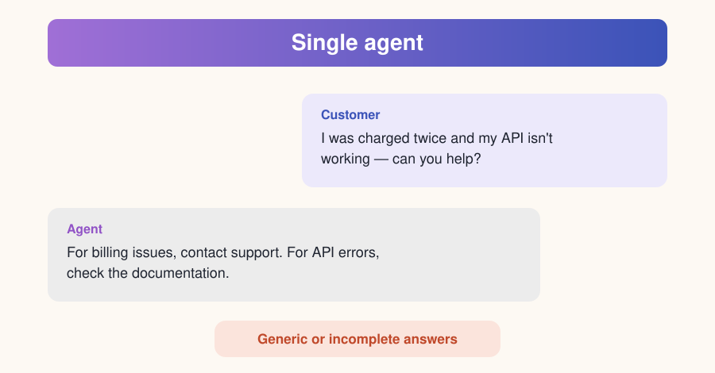
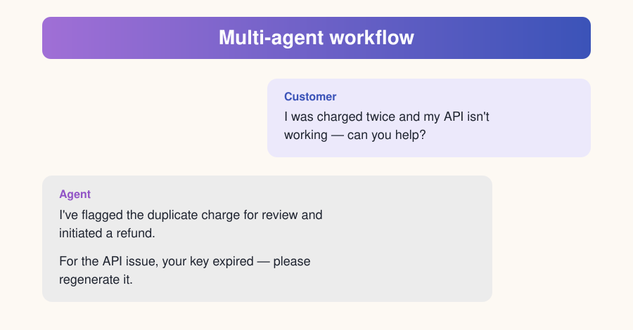

# 1. Introduction

> Part of the [Introduction to Agent-Driven Workflows](../README.md) module.
> **Next:** [What are workflows?](02-what-are-workflows.md)

---

Modern AI solutions often rely on **multiple agents working together** to analyze inputs, make decisions, and take action. In Microsoft Foundry, agent workflows provide a way to orchestrate these interactions using a combination of **agents**, **control flow**, and **runtime safeguards**.

Foundry includes a **visual workflow builder** that lets you design and test these systems without writing extensive code. Using the canvas, you can define:

- how agents are invoked,
- how data moves between steps,
- how decisions are made based on agent outputs.

You can also observe execution paths and inspect intermediate results to understand how your workflow behaves at runtime.

## The scenario used throughout this module

You're a developer responsible for automating **customer support workflows** at a growing SaaS company. Your team receives a steady stream of support tickets ranging from billing disputes to API errors and simple how-to questions.

- Manually reviewing each request **doesn't scale**.
- Fully automating responses **isn't always safe**.

Workflows let you combine multiple AI agents, conditional logic, and human-in-the-loop escalation. By using agent-driven workflows, you can triage many support requests efficiently and at scale **while maintaining reliability and control**.

  

  

## What you'll be able to do

- Explain how workflow nodes, variables, and agent outputs work together to control execution paths.
- Use structured agent outputs and conditional logic to route requests to the appropriate workflow steps.
- Implement loops (For-Each) to process multiple inputs efficiently within a single workflow.
- Apply human-in-the-loop and escalation patterns to manage uncertainty and low-confidence agent responses.
- Use Power Fx expressions to manipulate data, evaluate conditions, and control flow within workflows.

---

**Next:** [What are workflows?](02-what-are-workflows.md)
