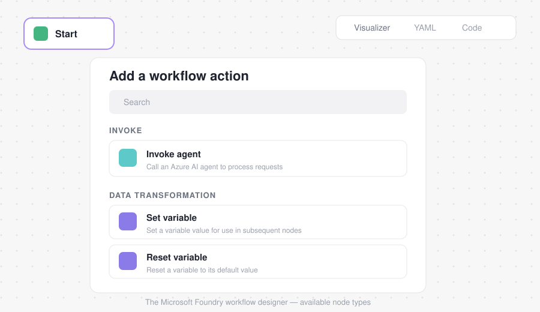

# 4. Create workflows in Microsoft Foundry

> Part of the [Introduction to Agent-Driven Workflows](../README.md) module.
> **Previous:** [Identify workflow patterns](03-identify-workflow-patterns.md) · **Next:** [Add agents to a workflow](05-add-agents-to-a-workflow.md)

---

Microsoft Foundry provides a **visual designer** that lets you build workflows as a sequence of connected nodes. Each node represents a specific action — invoking an agent, evaluating logic, or transforming data — and the connections between nodes define how execution flows from one step to the next.

You can start a workflow from a **blank canvas** or from a **predefined pattern** (such as a sequential workflow). The designer displays the workflow as a series of nodes laid out in execution order. As you build, you can move nodes, insert new steps, and inspect configuration details directly on the canvas.

> ⚠️ **Workflows aren't saved automatically.** Save your changes regularly to preserve each version of your design.

  

## Main node types

| Category | Node | What it does |
| --- | --- | --- |
| **Invoke** | **Invoke agent** | Invokes an AI agent from your project (or creates a new one). Returns free-text responses or structured output (e.g. JSON) that other nodes can use. Used for classification, reasoning, recommendations, or any AI-driven task. |
| **Flow** | **If/Else** | Branches execution based on conditions. |
| **Flow** | **Go To** | Jumps to another node in the workflow. |
| **Flow** | **For Each** | Loops over a list of items, performing the same actions for each one. |
| **Data transformation** | **Set Variable** | Assigns a value to a variable for later use. |
| **Data transformation** | **Reset Variable** | Clears or reinitializes a variable. |
| **Data transformation** | **Parse value** | Extracts specific data from structured outputs or converts values to different formats. |
| **Basic chat** | **Send message / Ask a question** | Sends messages to the user or collects input. Often paired with variables to capture responses that influence later logic or agent decisions. |
| **End** | **End** | Marks the conclusion of a workflow. Can optionally return a final result or status. |

## Nodes, control flow, and variables

- **Control flow** determines how each step is executed.
- **Variables** provide shared state across nodes, letting outputs from one step — agent results or user input — inform decisions or trigger more actions.
- Agent nodes are important, but effective automation relies on the **coordinated use of all node types**.

## Testing

Workflows execute within a **conversational context**, so you can interact with them through the chat window. This lets you observe how inputs move through the nodes and validate that each step behaves as expected before adding more complexity. As workflows grow, the visual designer makes it easy to trace execution paths and identify where logic branches or decisions occur.

Understanding nodes and how to combine them gives you the foundation for creating workflows that integrate AI reasoning, data handling, and control logic. **Nodes are the building blocks you assemble** to turn automation goals into functional, scalable workflows.

---

**Previous:** [Identify workflow patterns](03-identify-workflow-patterns.md) · **Next:** [Add agents to a workflow](05-add-agents-to-a-workflow.md)
